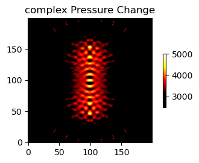

# TinyLev-Sim

TinyLev-Sim explores the pressure field generated by a ring-based ultrasonic levitator. The project models transducer geometry, computes directivity and interference patterns, and visualizes the resulting acoustic field to study stable levitation regions.

The project is largely a replication effort: it aims to reproduce the key plot types presented in the TinyLev paper and make the underlying simulation easier to inspect and experiment with in Python.

The main result of the project is the notebook [TinyLev-Simulation-Static.ipynb](/Users/christophbarth/PycharmProjects/TinyLev-Sim/TinyLev-Simulation-Static.ipynb), which walks through the static levitator setup and generates the core plots used to inspect the simulation.



The image above comes from `plotting.plot_pressure_change(left="complex", right=None)`.

## Project Layout

- `src/tinylev_sim/simulation/`: simulation code, including configuration, geometry, helper math, physics, and field generation
- `src/tinylev_sim/plotting/`: plotting helpers and plot data structures
- `tests/`: lightweight regression tests for the simulation core
- `TinyLev-Simulation-Static.ipynb`: the main notebook and primary project deliverable
- `assets/`: images used in the documentation

## Quick Start

Create and activate a virtual environment, then install the project in editable mode:

```bash
python -m venv .venv
source .venv/bin/activate
python -m pip install -e ".[dev]" --no-build-isolation
python -m pip install ipykernel
```

After that, start Jupyter with the same environment and open [TinyLev-Simulation-Static.ipynb](/Users/christophbarth/PycharmProjects/TinyLev-Sim/TinyLev-Simulation-Static.ipynb). Because the project uses a `src/` layout, the notebook should be run from an environment where `tinylev_sim` is installed, rather than by manually modifying `sys.path`.

## Example

```python
from tinylev_sim import plotting

plotting.plot_pressure_change(left="complex", right=None)
```

## Notes

- The simulation package is intentionally separated from plotting so numerical code can be reused without importing visualization dependencies.
- The notebook is the best entry point if you want to understand the project results quickly.

## Reference

This project is based on and attempts to replicate the plots from:

- [TinyLev: A multi-emitter single-axis acoustic levitator](https://pubs.aip.org/aip/rsi/article/88/8/085105/962938/TinyLev-A-multi-emitter-single-axis-acoustic)
